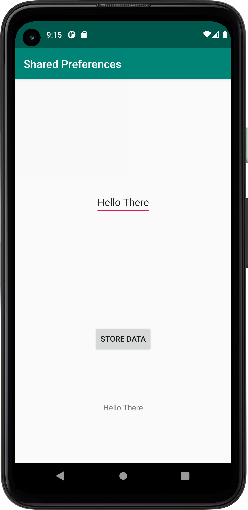

# Rapport

För att läsa data från shared prefernces skapade jag en textview som får sin text från shared preferences med nyckeln och standardvärdet ("abc", "No preference found.").
Jag döpte instanserna till prefRef samt prefRefEditor och textview till showtext.
```
private SharedPreferences prefRef;
private SharedPreferences.Editor prefRefEditor;
private TextView showText;
```
Följande rad kod sätter texten i min textview och tar då strängen från shared preferences.
```
showText= findViewById(R.id.mainTextView);
showText.setText(prefRef.getString("abc", "No preference found."));
```

Jag skapade en second activity class och tillhörande xml fil och skapade intent som startar den andra aktivteten. Följande rad kod visar hur min intent startar "secondActivity"
Intenten triggas av ett knapptryck så jag skapade en kapp och knapp listener.

```
openButton=findViewById(R.id.mainButton);
openButton.setOnClickListener(new View.OnClickListener() {
    @Override
    public void onClick(View view) {
       Intent intent = new Intent(MainActivity.this, SecondActivity.class);
       startActivity(intent);
    }
});
```

För att mata in data till shared preferences med en edittext så skapade jag en editor och matade in datan från edittexten till editron och använde metoden apply för
att "skriva" in datan till shared preferences. 
I "secondActivity" klassen initierade jag en editorm referens samt gav refernesen ett namn för att komma åt datan mellan olika aktiviteter. JAg skapade en knapp med listener som vid 
knapptryck hämtar datan från edittexten och lagrar den i shared preferences
```
public class SecondActivity extends AppCompatActivity {
private SharedPreferences secondPrefRef;
private SharedPreferences.Editor secondPrefRefEditor;
private EditText enterData;
private Button saveButton;
private TextView displayInput;

    @Override
    protected void onCreate(Bundle savedInstanceState) {
        super.onCreate(savedInstanceState);
        setContentView(R.layout.activity_second);

        secondPrefRef = getSharedPreferences("jarjar", MODE_PRIVATE);
        secondPrefRefEditor = secondPrefRef.edit();


        enterData =findViewById(R.id.secondEditText);
        saveButton= findViewById(R.id.storeButton);
        displayInput=findViewById(R.id.secondTextView);
        displayInput.setText(secondPrefRef.getString("abc", "No preference found."));

        saveButton.setOnClickListener(new View.OnClickListener() {
            @Override
            public void onClick(View view) {

                displayInput.setText(enterData.getText());
                secondPrefRefEditor.putString("abc", displayInput.getText().toString());
                secondPrefRefEditor.apply();


            }
        });
    }
}
```

För att visa datan i orignalaktiviteten skrev jag följande kod i "onresume"-metoden som körs samtidigt som on create men också när en aktivitet stängs och man återkommer till den första.
I "onResume" matar jag enkelt in samma referns till shared preferences som tidigare med namnet som speciferar till den data som matades in i den andra aktiviteten. Jag matar in i textview vid namn "showText"
och i och med att det görs i onresume så utförs detta varje gång man återgår till main aktivteten. Den uppdateras och matar in senast inskrivna värdet från edittexten i second activity.
```
protected void onResume() {
        super.onResume();

        showText.setText(prefRef.getString("abc", "No preference found."));

    }
```




